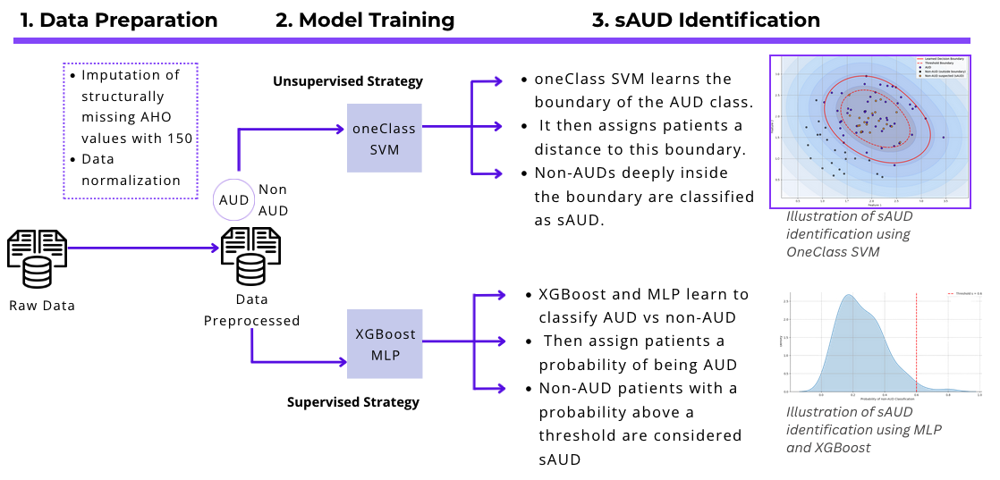
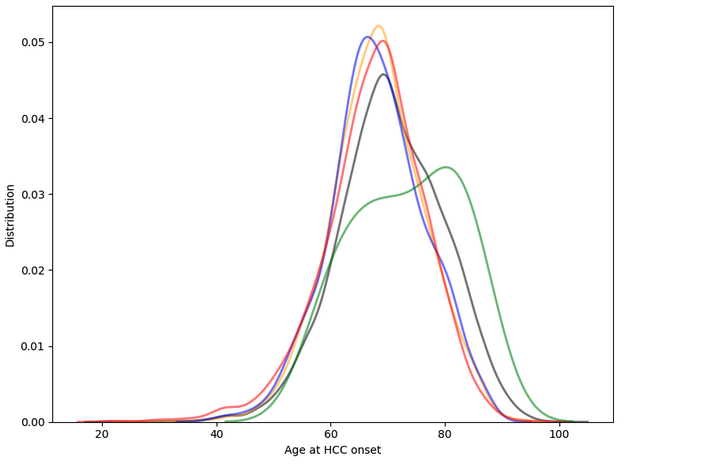

# SAUD Detector 
   This repository contains the code and methodology associated with our study on identifying subclinical alcohol use disorder (sAUD) in patients with type 2 diabetes (T2D), based on clinical data from the French National Hospital Discharge database.


## 📌 Context Overview

The global rise of type 2 diabetes (T2D) is strongly linked with an increased risk of hepatocellular carcinoma (HCC), one of the deadliest forms of liver cancer. Alcohol use disorder (AUD) is a key contributing factor, yet a substantial number of patients with subclinical alcohol use patterns (sAUD) remain undiagnosed and untreated.

This project aims to detect these sAUD patients — who are clinically similar to those diagnosed with AUD — using a large-scale dataset of over 3 million T2D patients. Tackling this problem requires addressing significant technical challenges such as:
- Highly imbalanced class distributions (AUD vs non-AUD)
- Heterogeneous and sparse features
- Structurally missing data (age at HCC onset only available for a small subset of patients)

Our analysis shows that a subset of non-AUD patients exhibits clinical patterns — including age at HCC onset — that are highly similar to those of diagnosed AUD patients.

This repository is a companion to the scientific article and provides the full pipeline for our saud detection methodologie. 


## 🧠 Method Overview 
This project aims to identify subclinical AUD (sAUD) patients — a subset of non-AUD individuals who share similar characteristics with diagnosed AUD patients — using both supervised and unsupervised machine learning approaches.
We implemented and evaluated the following models: 

- One-Class SVM:
Trained only on reliably labeled AUD cases, this unsupervised method learns a decision boundary that defines the AUD class. After training, it assigns a signed distance to each patient relative to this boundary. Non-AUD patients who fall within the boundary are considered potential sAUD cases, as they exhibit patterns similar to those of known AUD patients.

- XGBoost and MLP (Multi-Layer Perceptron):
These supervised models use both AUD and non-AUD labels during training. Although the non-AUD labels may include hidden sAUD cases, incorporating them enriches the learning process. Each model outputs a probability score indicating how likely a patient is to belong to the AUD class. A Weighted Binary Cross-Entropy loss is used to compensate for class imbalance. 

All models were optimized through hyperparameter tuning, using the Area Under the ROC Curve (AUC) as the main evaluation metric, which is well-suited for imbalanced classification tasks.

After training, each model was applied to the non-AUD population to detect potential sAUD individuals:

   - For XGBoost and MLP, we define a probability threshold above which a patient is considered sAUD.

   - For One-Class SVM, we define a distance threshold based on how deeply a patient lies within the learned AUD boundary.

Thresholds were chosen to maximize the similarity (measured using Wasserstein distance) between the Age at Hepatic Onset (AHO) distributions of detected sAUD and confirmed AUD patients. The best results were obtained using XGBoost and One-Class SVM, both of which identified sAUD subpopulations with AHO distributions closely matching that of the AUD group. These models also revealed a high prevalence of Hepatocellular Carcinoma (HCC) among the identified sAUD patients, suggesting strong clinical relevance.

For a visual summary of the full methodology, please refer to the figure below.

For complete implementation details, including model configurations and tested hyperparameters, see the corresponding scripts in this repository.

<p align="center">
  
</p>


## 📂 Project Structure 

```
saud_detector
├─ LICENSE
├─ README.md
├─ logs
│  ├─ avaluate_logs
│  ├─ identified_saud_logs
│  ├─ prediction_logs
│  ├─ search_threshold_logs
│  └─ training_logs
├─ models
│  ├─ best_MLP.pkl
│  ├─ best_oneClassSVM.pkl
│  └─ best_xgboost.pkl
├─ reports
│  ├─ AUD_nonAUD_classif
│  │  └─ conf_matrices
│  │     ├─ MLP.csv
│  │     ├─ oneClassSVM.csv
│  │     └─ xgboost.csv
│  ├─ identified_saud
│  │  ├─ age_distribution_all_data.eps
│  │  ├─ dist_wasserteIn_plots.csv
│  │  └─ saud_stats_by_model.csv
│  └─ sAUD_threshold_search
│     ├─ MLP
│     │  ├─ plot_hcc_age_onset_by_seuils.pdf
│     │  └─ wasserstein_distance_by_threshold.csv
│     ├─ oneClassSVM
│     │  ├─ plot_hcc_age_onset_by_seuils.pdf
│     │  └─ wasserstein_distance_by_threshold.csv
│     └─ xgboost
│        ├─ plot_hcc_age_onset_by_seuils.pdf
│        └─ wasserstein_distance_by_threshold.csv
├─ requirement.txt
├─ setup.py
└─ src
   ├─ __init__.py
   ├─ features
   │  ├─ __init__.py
   │  └─ preprocessing.py
   └─ models
      ├─ MLP.py
      ├─ __init_.py
      ├─ available_models.py
      ├─ base.py
      ├─ evaluate_classification_perfs.py
      ├─ get_identified_saud_stats.py
      ├─ oneClassSVM.py
      ├─ predict_model.py
      ├─ threshold_search.py
      ├─ train_model.py
      ├─ utils.py
      ├─ xgb_config.json
      └─ xgboost.py
```

## Project Files Description
This repository is organized as follows: 
- src/:
   - features/preprocessing.py : Data preprocessing pipeline. 

      One of the key preprocessing steps involves handling structurally missing data, particularly in the Age of HCC Onset (AHO) variable. To reflect the absence of HCC, missing AHO values were  
      imputed with 150 representing a hypothetical extremely late onset that minimally impacts the patient profile. This variable was then normalized using the formula: 
      $$ \text{Normalized AHO} = \left( \frac{150 - \text{age value}}{150} \right) \times \alpha $$ 
      where $\alpha$ is a scaling factor ensuring that the normalized AHO distribution is comparable in magnitude to binary features.
      Finally, the dataset was randomly split into training (50%), validation (20%), and test (30%) sets.

   - models/:
      - MLP.py, xgboost.py, oneClassSVM.py: Model architectures 

      - train_model.py:  
         This script trains a classification model using hyperparameter search. It loads and preprocesses the data, tests multiple hyperparameter configurations (defined in the config file),  
         selects the best model based on validation AUC, and saves it.

      - predict_model.py:  
      This script loads a previously trained model and applies it to the processed dataset to generate predictions.   
      It outputs both probability scores and predicted labels for each data split (train, validation, test), which are saved to CSV files.

      - evaluate_classification_perfs.py:  
      This script evaluates the best trained model by loading its predictions on the dataset, computing classification metrics for each data split (train, validation, test), and saving these performance results (confusion matrices). 

      - threshold_search.py:  
      This script performs a threshold search to identify the optimal classification probability cutoff for detecting subclinical alcohol use disorder (sAUD) cases. For each threshold, it selects patients with high predicted probability but no AUD diagnosis, and compares the age distribution of hepatocellular carcinoma (HCC) onset between these sAUD patients and diagnosed AUD patients using the Wasserstein distance. 
      Results are saved in a CSV file, and a plot is generated to visualize the age distributions across thresholds.

      - get_identified_saud_stats.py:  
      This script performs an evaluation of the identified subclinical alcohol use disorder (sAUD). It includes functions to visualize the age distribution at hepatocellular carcinoma (HCC) onset for different patient groups (T2D, AUD,  
      predicted sAUDs by XGBoost, MLP, and SVM), and to compute the Wasserstein distances between predicted sAUD distributions and the true AUD group.  
      Additionally, it generates summary statistics on the number and characteristics of identified sAUDs across models.

      - utils.py, base.py, available_models.py: Utility and base functions.
      - xgb_config.json, mlp_config.json, svm_config.json : Configuration file for XGBoost, MLP and oneClass SVL best hyperparameters.

- models/: Contains the best trained model files (pickled). 

- logs/: Contains log files from each phase of the pipeline( preprocessing, training, evaluation, thershold search, identified sAUDs analysis)

- reports/ : Results and analysis outputs:  
   - AUD_nonAUD_classif/ : Confusion matrices for each model.
   - identified_saud/ : Statistics and AHO distribution plots of detected sAUD cases.
   - sAUD_threshold_search/: Wasserstein distances and plots used to select optimal thresholds for each model.  
   👉 See the Results section above for a more detailed interpretation of these outputs.

- config.py: Configuration to set parameters.

- requirement.txt: List of Python dependencies required to run the project.

- setup.py: Package setup file (optional, for installing as a module).

- README.md: Project documentation and usage instructions.

- LICENSE: License file for the project.


# 📈 Results

## AUD/non-AUD Classification performance :

In Table 1, we presents the models’ performances for classifying AUD versus non-AUD patients, mainly using AUC as the metric. The One-Class SVM has poor overall discrimination (AUC = 0.52) but detects AUD cases well (TPR = 0.86)  
despite many false positives (FPR = 0.82). The MLP accurately identifies non-AUD patients (TNR = 0.89) but misses many AUD cases (TPR = 0.54). XGBoost achieves the best balance with the highest AUC (0.73) and moderate detection rates for both AUD (TPR = 0.63)   
and non-AUD (TNR = 0.82).

Confusion matrices, which illustrate these trade-offs and error patterns, are saved as CSV files in the folder [/AUD_nonAUD_classif/conf_matrices](./AUD_nonAUD_classif/conf_matrices). These results were obtained using the script [evaluate_classification_perfs.py](./src/models/evaluate_classification_perfs.py) evaluate_classification_perfs.py

<div >
<table>
  <thead>
    <tr>
      <th>Model</th>
      <th>AUC</th>
      <th>ACC</th>
      <th>FPR</th>
      <th>TNR</th>
      <th>FNR</th>
      <th>TPR</th>
      <th>F1 Score</th>
    </tr>
  </thead>
  <tbody>
    <tr>
      <td>XGBoost</td>
      <td align="center">0.73</td>
      <td align="center">0.81</td>
      <td align="center">0.18</td>
      <td align="center">0.82</td>
      <td align="center">0.37</td>
      <td align="center">0.63</td>
      <td align="center">0.32</td>
    </tr>
    <tr>
      <td>oneClass SVM</td>
      <td align="center">0.52</td>
      <td align="center">0.23</td>
      <td align="center">0.82</td>
      <td align="center">0.18</td>
      <td align="center">0.14</td>
      <td align="center">0.86</td>
      <td align="center">0.14</td>
    </tr>
    <tr>
      <td>MLP</td>
      <td align="center">0.72</td>
      <td align="center">0.87</td>
      <td align="center">0.10</td>
      <td align="center">0.89</td>
      <td align="center">0.46</td>
      <td align="center">0.54</td>
      <td align="center">0.37</td>
    </tr>
  </tbody>
</table>
<p>
  Table 1 : AUD VS non-AUD classification performances of the different models using the optimal hyperparameters. 
</p>

</div>


## Detecting subclinical-AUD patients : 

After training the models to distinguish AUD from non-AUD patients, we identify sAUD individuals within the non-AUD group based on model outputs. XGBoost and MLP provide AUD probability scores, while One-Class SVM uses distance to the decision boundary.
Thresholds are optimized using Wasserstein distance to match the age-at-HCC-onset (AHO) distribution of AUD patients. The full procedure for threshold selection is implemented in the [threshold_search.py](./src/models/threshold_search.py) script.  
For each model, the evaluation of different thresholds including corresponding Wasserstein distances and AHO distribution plots is available in the [reports/sAUD_threshold_search](./reports/sAUD_threshold_search) folder.

The figure below shows the AHO probability distributions for each model, using the best threshold selected. The black curve represents the T2D population, while the orange curve corresponds to AUD patients. The sAUD subgroups identified by XGBoost (blue), MLP (green), and One-Class SVM (red) are also shown. Notably, the sAUD populations identified by XGBoost and One-Class SVM exhibit AHO distributions that closely resemble that of AUD patients, suggesting a strong similarity between these groups.



Using the optimal thresholds, each model identifies a subset of sAUD patients within the non-AUD group. The MLP model selects a small fraction (0.40%) with low HCC prevalence, while XGBoost and One-Class SVM detect sAUD groups with significantly higher HCC prevalence (>20%). One-Class SVM identifies about three times more sAUD cases than XGBoost, but over 70% of the HCC cases detected by XGBoost are also found by the SVM, suggesting strong consistency between the two models.
he following table summarizes the key statistics of the sAUD populations identified by each model. 


<div >
<table>
  <thead>
    <tr>
      <th>Model</th>
      <th>sAUD Count</th>
      <th>sAUD with HCC count</th>
      <th>% sAUD over all T2D patients</th>
      <th>% sAUD over AUDs</th>
      <th>% sAUD over non-AUDs</th>
      <th>sAUD's HCC prevelence</th>
      <th>Best threshold</th>
      <th>Wasserstein distance</th>
    </tr>
  </thead>
  <tbody>
    <tr>
      <td>XGBoost</td>
      <td align="center">5658</td>
      <td align="center">1230</td>
      <td align="center">0.20</td>
       <td align="center">2.86</td>
      <td align="center">0.22</td>
      <td align="center">21.74</td>
      <td align="center">0.96</td>
      <td align="center">0.22</td>
    </tr>
    <tr>
      <td>oneClass SVM</td>
      <td align="center">17545</td>
      <td align="center">3389</td>
      <td align="center">0.64</td>
      <td align="center">8.86</td>
      <td align="center">0.67</td>
      <td align="center">19.32</td>
      <td align="center">0.039</td>
      <td align="center">4.97</td>
    </tr>
    <tr>
      <td>MLP</td>
      <td align="center">10150</td>
      <td align="center">29</td>
      <td align="center">0.37</td>
      <td align="center">5.13</td>
      <td align="center">0.40</td>
      <td align="center">0.29</td>
      <td align="center">0.96</td>
      <td align="center">0.62</td>
    </tr>
  </tbody>
</table>
<p>
  Table 2 : Summary of sAUD detection results across different models using the optimal threshold. 
</p>

</div>

Both the figure and the corresponding statistics for the sAUD populations identified by each model were generated using the [get_identified_saud_stats](./src/models/get_identified_saud_stats.py) script. 

## ⚙️ Installation

#### 1 Clone the repository
```bash
   git clone https://github.com/Maison-de-la-Simulation/AIME-2025  
   cd project 
```

#### 2 Create and activate a virtual environment 

```bash
   python3.10 -m venv my_env
   source my_env/bin/activate 
   
   # Install the required libraries
   pip install -r requirement.txt 
```


## Run Instructions 
⚠️ The project is still under development and is not yet installable via `pip`.  
For now, to run the project, we run the following commands manually, in order:

```bash
# Step 1: preprocess data 
python -m src.features.preprocessing 

# train a model 
python -m src.models.train_model --model ModelName  

# predict with the trained model : 
python -m src.models.predict_model --model ModelName 

# evaluate classification performances of the trained model  : 
python -m src.models.evaluate_classification_perfs --model ModelName 

# threshold search of the trained model: 
python -m src.models.threshold_search --model ModelName 

```
# 👤 Authors

- Melissa LARBI 
- Edouard AUDIT 
- Joel CHAVAS 
- Simplice DONFACK 
- Vincent MALLET 


